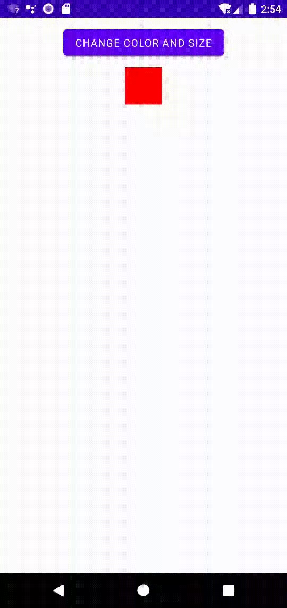

# android-jetpack-compose-animation-samples
animation samples for jetpack-compose

# development environment

# animateColorAsState

[code](https://github.com/LeoAndo/android-jetpack-compose-animation-samples/blob/afdcaf85fbfc5a18b8930bcb7a155063fb70c697/AnimationSample/app/src/main/java/com/example/animationsample/demo/AnimateAsState.kt#L20:L43) 

# animateFloatAsState

[code](https://github.com/LeoAndo/android-jetpack-compose-animation-samples/blob/afdcaf85fbfc5a18b8930bcb7a155063fb70c697/AnimationSample/app/src/main/java/com/example/animationsample/demo/AnimateAsState.kt#L45:L69) 

# updateTransition
[code](https://github.com/LeoAndo/android-jetpack-compose-animation-samples/blob/7eb40f9951340518ef84d9853a378b826ab8690a/AnimationSample/app/src/main/java/com/example/animationsample/demo/Transition.kt#L28:L69) 

# AnimatedVisibility
[code](https://github.com/LeoAndo/android-jetpack-compose-animation-samples/blob/f3da8a8c1e447263069a7e0be97679cd80adc63d/AnimationSample/app/src/main/java/com/example/animationsample/demo/AnimatedVisibility.kt#L16:L42) 

# animateContentSize

[code](https://github.com/LeoAndo/android-jetpack-compose-animation-samples/blob/d5b8d88d8c6ca54cb3173757425ad1356f661b5d/AnimationSample/app/src/main/java/com/example/animationsample/demo/AnimateContentSize.kt) 

# CrossFade
[code](https://github.com/LeoAndo/android-jetpack-compose-animation-samples/blob/79a144f4b43400593d9431464c3854c23c73dc28/AnimationSample/app/src/main/java/com/example/animationsample/demo/CrossFade.kt) 

# AnimatedContent

[code](https://github.com/LeoAndo/android-jetpack-compose-animation-samples/blob/f3da8a8c1e447263069a7e0be97679cd80adc63d/AnimationSample/app/src/main/java/com/example/animationsample/demo/AnimatedContent.kt) 

# repeatable

[code](https://github.com/LeoAndo/android-jetpack-compose-animation-samples/blob/afdcaf85fbfc5a18b8930bcb7a155063fb70c697/AnimationSample/app/src/main/java/com/example/animationsample/demo/AnimateAsState.kt#L72:L102) 

# refs
https://www.youtube.com/watch?v=7yY2OocGiQU 
https://developer.android.com/jetpack/compose/animation?hl=ja#overview 
